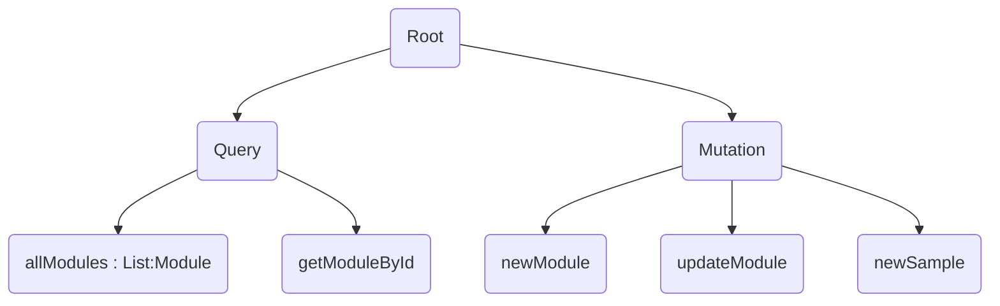

# @home API

This api serve :

- the *hardware* to populate the db with the creation of modules and add new samples for each modules
- the *web application* and the *mobile application* for getting information about all modules and permite to modify some information of the modules.

---

[TOC]

---

## Prerequisites

1. Maven version 3.5
2. JDK 1.8
3. intelliJ
4. The depository: git@gitlab.com:Woodbox/central-box/box-api.git

---

## Installation

The root folder is **box-api/boxapi/**

### Development

In a *terminal* build the application by executing `mvn clean install`  in the **root folder**.

### Production

...

## Execution

### Development

In a *terminal* run the application with `mvn spring-boot:run` or you can use the the `run`button on **intelliJ**

This will by default **host the GraphQL API on the */graphql* endpoint, and accept POST requests to it.**

### Production

...

## Test

You can test all **Schema** of the api by using the graphical interface `localhost:8080/graphiql`

---

## Schemas



### Roots
#### Query
- allModules: [Module]
  Returns all the modules as an array

- getModuleById(id: String!): Module
  Used to retrieve a module's data by its unique identifier.
#### Mutation
- newModule(module: ModuleInput!): Module
  Creates a new module to be linked to the WoodBox.

- updateModule(id: String!, name: String, location: String, firmware: String): Module
  Allows the modification of a module previously linked to the WoodBox

- newSample(sample: SampleInput!): Sample!
  Allows the insertion of a new environmental measure harvested by a module into the API's database. See also the **Sample type**
###Types

- Module : **Type** representing one module connected to a woodbox

  ```
  type Module {

      # The unique identifier of the module
      id: ID!

      # Mac address of the module
      # Under the format xx:xx:xx:xx:xx:xx
      # Where x represent an hexadecimal digit
      mac: String!

      # The name of the module
      # Either the default one or
      # one choosen by the user
      name: String!

      # The room where the module is located
      location: String!

      # The type of module, returned as a lower case String
      # As of now, can be either:
      # - hygrometer
      # - thermometer
      # - luxmeter
      # - athmospherics
      type: String!

      # The vendor of the module
      # "woodbox"
      vendor: String!

      # environmental samples gathered by the module.
      # (see the Sample type)
      # returned as an array
      samples: [Sample]!
  }
  ```

- Sample : **Type** representing the *data and metadata* of a measure harvested by a module of the WoodBox.

  ```
  type Sample {

    # The id of the module that gathered the environmental sample
    moduleId: Int

    # The data and metadata  of the samples sent by the module
    payload: String!

    # The date & time the sample was harvested at.
    # Formatted as such: "YYYY-MM-DD hh:mm:ss.µs"
    # For example: 2018-01-02 12:56:13.327164
    date: String!
  }
  ```
### Input

- ModuleInput : It's like a type, used to create a new module from the API.
  
  ```
  input ModuleInput{
    	boxId: String!
    	mac: String!
    	name: String!
    	location: String!
    	type: String!
    	vendor: String!
    	firmware: String!
  }
  ```
- SampleInput : It's like a type, used to insert samples via the API
  
  ```
  input SampleInput{
  	moduleId: Int!
  	payload: String!
  	date: String!
  }
  ```

---

##  Using Examples

You can use Graphiql at `http://localhost:8080/graphiql` to test the schemas.

### Query

You can get all attribute in [Types](#types).

When a variable is required, like the id in `getModuleById(id: String!): Module`, the ''**!**'' is present.

```json
query
{
  	getModuleById(id:"4"){
  		name
    	type
    	samples{
    		date
    	}
  	}
    allModules{
   		mac
    	location
    	vendor
  	}
}
```

### Mutation

You can perform **one** mutation per request.

For `newModule(module: ModuleInput!): Module` you have to fill in all the fields of the input [**ModuleInput** ](#input).

```json
mutation{
  newModule(module: {
    boxId: "4"
    mac:"cc:cc:cc:cc:cc"
    name:"luxmeter chambre"
    location:"2"
    type:"luxmeter"
    vendor: "woodbox"
    firmware:"1.0.0"})
  {
    name
    type
  }
}
```

Some parameter are optional like for `updateModule(id: String!, name: String, location: String, firmware: String): Module`.

```json
mutation{
	updateModule(id:"5", name: "capteur chambre"){
  		location
	}
}
```

