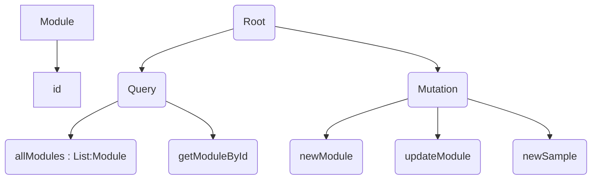

# @home API

This api serve :

- the *hardware* to populate the db with the creation of modules and add new samples for each modules
- the *web application* and the *mobile application* for getting information about all modules and permite to modify some information of the modules.

---

[TOC]

---

## Prerequisites

1. Maven version 3.5
2. JDK 1.8
3. intelliJ
4. The depository: git@gitlab.com:Woodbox/central-box/box-api.git

---

## Installation

The root folder is **box-api/boxapi/**

### Development

In a *terminal* build the application by executing `mvn clean install`  in the **root folder**.

### Production

...

## Execution

### Development

In a *terminal* run the application with `mvn spring-boot:run` or you can use the the `run`button on **intelliJ**

This will by default host the GraphQL API on the */graphql* endpoint, and accept POST requests to it.

### Production

...

## Test

You can test all **Schema** of the api by using the graphical interface `localhost:8080/graphiql`

---

## Schemas

